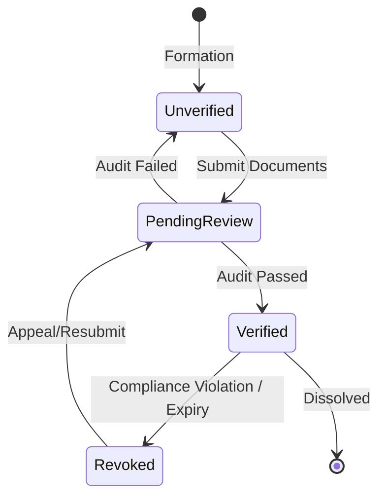
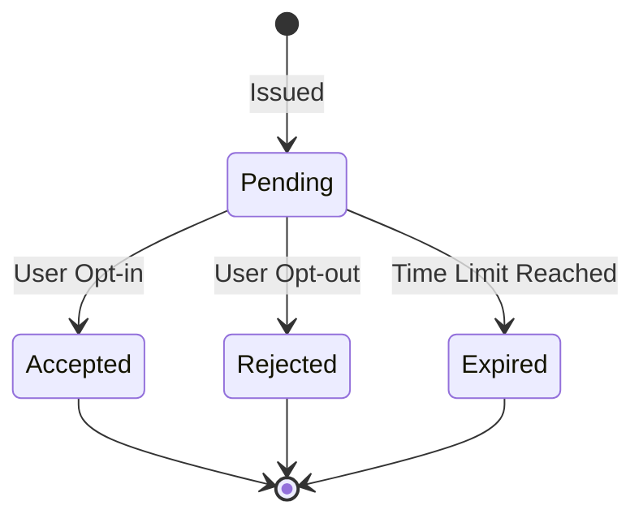
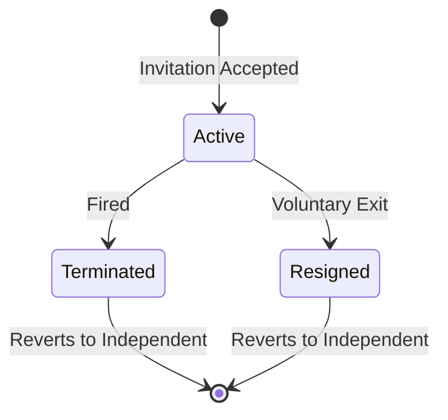
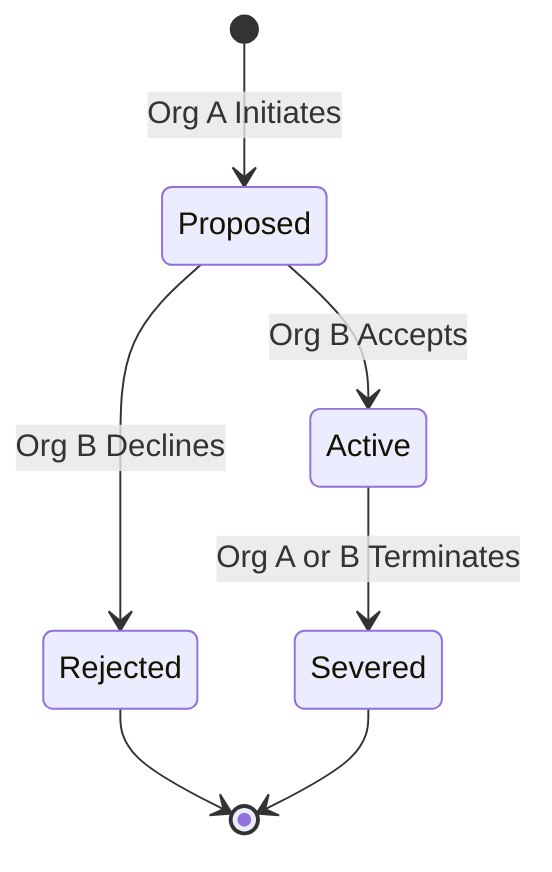
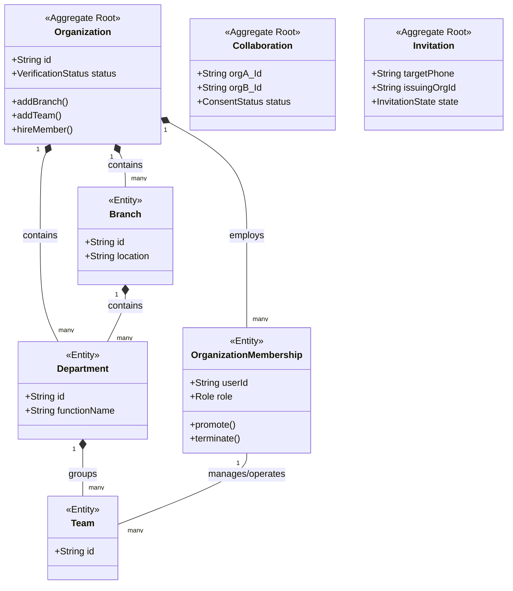

# Organization Domain Architecture v1.0

## 1. Bounded Context

### Why Organization is its own Bounded Context
The Organization domain represents the structural hierarchy and human resource management side of the Parther Logistics platform. It is a distinct Bounded Context because the rules governing corporate structures, team assignments, and employment lifecycles change independently from the core logistics engine (Booking/Dispatch) or the financial ledger (Wallet/Payment). Isolating it ensures that "how a load is moved" does not become entangled with "who legally employs the person moving it."

### Responsibilities
- Managing hierarchical business structures (Branches, Departments, Teams).
- Orchestrating the lifecycle of worker employment and independent reversion.
- Resolving role-based and structural capabilities.
- Maintaining secure inter-organizational collaborations.
- Tracking enterprise verification statuses.

### Boundaries and Dependencies
- **Upstream Dependencies**: Depends on the **Identity/User Domain** (for basic user authentication and profiles).
- **Downstream Dependencies**: The **Dispatch/Booking Domain** consumes Organization events (e.g., to know if a Worker is verified and eligible for a shift). The **Billing Domain** consumes Collaboration agreements to route invoices.

---

## 2. Aggregate Roots

An Aggregate Root (AR) is the primary entry point for domain state changes, ensuring invariants are maintained within its transactional boundary.

- **Organization**: The central AR. It encapsulates Branches, Departments, Teams, and Memberships. Any structural change (e.g., adding a Team) or Membership change (e.g., promoting a Supervisor) must go through the Organization AR to ensure invariants (like "Only one Primary Owner") are upheld.
- **Invitation**: A separate AR. Since an Invitation involves a user who is *not yet* part of the Organization, its lifecycle (Pending, Accepted, Rejected, Expired) exists outside the Organization AR's direct boundary until acceptance.
- **Collaboration**: A separate AR. A collaboration inherently involves *two* distinct Organization ARs. Since an AR cannot reach into another AR to mutate it, the Collaboration agreement stands alone to track the mutual opt-in state between the two parties.

*(Note: Verification is treated as an Entity or Value Object bound to the Organization AR rather than a standalone AR, as its lifecycle directly dictates the Organization's operational state).*

---

## 3. Entities

Entities are objects with a distinct identity that persists over time, even if their properties change.

- **Branch**
  - *Purpose*: Represents a geographical or operational node within an Organization.
  - *Identity*: Branch ID (local to Organization).
  - *Lifecycle*: Created by Admin, holds Departments, can be archived or deleted.
  - *Ownership*: Owned entirely by the Organization AR.
- **Department**
  - *Purpose*: A functional division grouping Teams.
  - *Identity*: Department ID.
  - *Lifecycle*: Created within a Branch or Organization, holds Teams.
  - *Ownership*: Owned by the Organization AR.
- **Team**
  - *Purpose*: The lowest structural grouping of Workers for targeted operations.
  - *Identity*: Team ID.
  - *Lifecycle*: Created within a Department/Branch, managed by a Supervisor.
  - *Ownership*: Owned by the Organization AR.
- **OrganizationMembership**
  - *Purpose*: Represents the binding contract between a User and the Organization.
  - *Identity*: Membership ID.
  - *Lifecycle*: Born from an accepted Invitation; transitions through roles; dies upon termination.
  - *Ownership*: Owned by the Organization AR.
- **Project**
  - *Purpose*: A collaborative or internal initiative that generates Shifts.
  - *Identity*: Project ID.
  - *Lifecycle*: Initiated by an Organization; spans time; resolved when completed.
  - *Ownership*: Owned by the Organization AR (or shared via Collaboration).
- **Shift**
  - *Purpose*: A scheduled block of labor assigned to a Worker.
  - *Identity*: Shift ID.
  - *Lifecycle*: Scheduled, In-Progress, Completed, or Cancelled.
  - *Ownership*: Generated by a Project, fulfilled by an OrganizationMembership.

---

## 4. Value Objects

Value Objects possess no distinct identity; they are defined entirely by their attributes and must be immutable.

- **Capability**: Represents a specific action (e.g., `INVITE_WORKER`, `DELETE_BRANCH`). Immutable; an Admin is granted a set of Capabilities.
- **VerificationStatus**: Represents the current audit state (`UNVERIFIED`, `PENDING`, `VERIFIED`, `REVOKED`). 
- **BusinessRegistration**: Encapsulates legal tax IDs, incorporation numbers, and document URLs.
- **Role**: A named collection of Capabilities (e.g., `Supervisor`, `Employee`).
- **ShiftDuration**: Encapsulates start time, end time, and timezone. Validates that start is before end.

---

## 5. Domain Services

Domain Services hold business logic that spans multiple Aggregates or does not naturally fit within a single Entity.

- **OwnershipTransferService**
  - *Responsibility*: Ensures the atomic transfer of the `Primary Owner` role. Demotes the current owner and promotes the target member simultaneously, ensuring the "Exactly one Primary Owner" invariant is never violated during the transaction.
- **MembershipService**
  - *Responsibility*: Orchestrates the acceptance of an Invitation. It interacts with the User Domain to verify the worker is independent, then commands the Organization AR to create the Membership.
- **OrganizationVerificationService**
  - *Responsibility*: Consumes external KYC/KYB data to transition the Organization's `VerificationStatus`. Triggers platform-wide events if an Organization's status is revoked.
- **CapabilityResolver**
  - *Responsibility*: A pure service that takes an OrganizationMembership and a requested Action, traversing the hierarchy to resolve if the member has the necessary Capabilities to perform the action.

---

## 6. Domain Events

Domain Events signal that something significant occurred within the business.

- **OrganizationCreated**: Published when a new structural umbrella is formed. (Consumed by Billing).
- **OrganizationVerified**: Published when legal checks pass. (Consumed by Dispatch to unlock load bidding).
- **OrganizationSuspended**: Published when Verification is revoked. (Consumed by Dispatch to immediately halt active shifts).
- **InvitationIssued**: Published when an Organization invites a user. (Consumed by Notifications).
- **WorkerJoinedOrganization**: Published when an Invitation is accepted. (Consumed by Dispatch to update worker availability, consumed by User Domain to update employment status).
- **WorkerReleased**: Published when a Membership is terminated. (Consumed by Dispatch; User Domain marks worker as Independent).
- **CollaborationFormed**: Published when mutual consent is reached. (Consumed by Projects to allow cross-org shift assignments).
- **OwnershipTransferred**: Published when the Primary Owner changes. (Consumed by Audit/Billing).

---

## 7. Invariants

Invariants are absolute business rules that must remain true at all times within an Aggregate.

- **Exactly one Primary Owner**: An Organization AR must never have 0 or 2+ Primary Owners. *Why: Legal and billing liability requires a singular point of failure/authority.*
- **One active employment**: A Worker cannot hold an active OrganizationMembership in two different Organization ARs simultaneously. *Why: Prevents shift collisions and legal liability overlapping.*
- **No Orphaned Teams**: A Team Entity must be structurally tethered to a Department, Branch, or the Root Organization. *Why: Prevents unmanaged labor pools.*
- **Verified Operation**: Shifts cannot be assigned to platform-level loads if the Organization is Unverified. *Why: Regulatory compliance.*
- **Immutable Collaboration Consent**: A Collaboration AR cannot exist without the cryptographic/recorded consent of both Primary Owners or authorized Admins. *Why: Prevents spoofed vendor partnerships.*

---

## 8. State Machines

### Organization Verification State

### Invitation State

### Membership Lifecycle

### Collaboration State

---

## 9. Domain Relationships

---

## 10. Ubiquitous Language

- **Organization**: The top-level legal and structural B2B entity on the platform.
- **Company / Contractor / Vendor**: Specific classifications of an Organization based on business intent.
- **Independent Worker**: A human laborer utilizing the platform autonomously without an active OrganizationMembership.
- **Organization Member**: A human user actively employed and bound to an Organization.
- **Primary Owner**: The singular user holding absolute legal and destructive authority over an Organization.
- **Organization Admin**: A Member delegated structural and administrative Capabilities.
- **Supervisor**: A Member delegated to oversee Teams and Shifts.
- **Employee**: A base-level Member providing labor without administrative Capabilities.
- **Collaboration**: A formal, dual opt-in relationship allowing two Organizations to share resources.
- **Capability**: A granular, immutable action that a Member is authorized to perform.
- **Invitation**: A time-bound proposal to transition an Independent Worker into an Organization Member.
