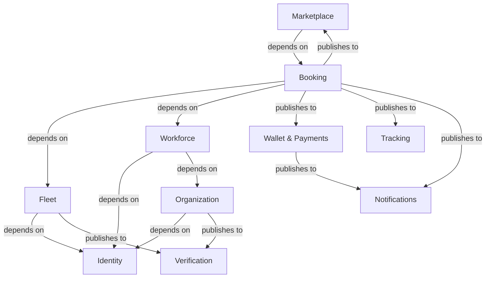

# Platform Domain Map v1.0

## 1. Domain Identification & Ownership

This section strictly defines the bounded contexts within the Parther Logistics platform and explicitly dictates their business ownership perimeters.

### Identity Domain
- **Purpose**: Manage who a human user is and how they authenticate.
- **Responsibilities**: OTP generation, JWT issuance, session management, and base user profiles.
- **What it owns**: Phone numbers, passwords, refresh tokens, user IDs.
- **What it never owns**: Employment status, wallet balances, or booking history.
- **Upstream**: None.
- **Downstream**: Organization, Workforce, Fleet, Booking (every domain depends on Identity).
- **Events Published**: `UserRegistered`, `UserAuthenticated`, `UserDeleted`.
- **Events Consumed**: None.
- **External Integrations**: MSG91 (OTP).
- **Future Scalability**: Highly cacheable; naturally scales horizontally.

### Organization Domain
- **Purpose**: Manage B2B hierarchies and structural relationships.
- **Responsibilities**: Branches, Departments, Teams, B2B Collaborations, Memberships.
- **What it owns**: Organization structural hierarchy, Roles, Capabilities, Invitations.
- **What it never owns**: Fiat money, logistics loads, or live vehicle tracking.
- **Upstream**: Identity.
- **Downstream**: Workforce, Projects, Billing.
- **Events Published**: `OrganizationCreated`, `WorkerEmployed`, `CollaborationFormed`.
- **Events Consumed**: `VerificationStatusChanged`.
- **External Integrations**: None.
- **Future Scalability**: Read-heavy; suited for materialized views.

### Workforce Domain
- **Purpose**: Manage the availability, scheduling, and deployment of human labor.
- **Responsibilities**: Gigs, Shifts, Attendance, skill-matching, nearest-worker dispatch.
- **What it owns**: Worker availability states, Shift schedules, SOS triggers.
- **What it never owns**: The overall structural umbrella (Organization) or the core load (Booking).
- **Upstream**: Identity, Organization.
- **Downstream**: Booking, Tracking.
- **Events Published**: `ShiftStarted`, `ShiftCompleted`, `WorkerStatusChanged`.
- **Events Consumed**: `ProjectCreated`, `WorkerEmployed`.
- **External Integrations**: None.
- **Future Scalability**: Highly volatile writes; needs optimized geospatial querying.

### Fleet Domain
- **Purpose**: Manage vehicular assets and their direct ownership.
- **Responsibilities**: Trucks, vehicle documents, fleet owner-to-driver assignments.
- **What it owns**: Vehicle specifications, Fleet affiliations.
- **What it never owns**: Booking loads, Customer wallets.
- **Upstream**: Identity.
- **Downstream**: Booking, Tracking, Verification.
- **Events Published**: `VehicleAdded`, `VehicleAssigned`.
- **Events Consumed**: `VerificationStatusChanged`.
- **External Integrations**: None.

### Booking Domain
- **Purpose**: The core logistics engine managing the state machine of a load.
- **Responsibilities**: Load creation, state transitions, POD (Proof of Delivery), invoice generation.
- **What it owns**: Booking state (`DRAFT`, `ACCEPTED`, `IN_TRANSIT`), goods declarations.
- **What it never owns**: Worker schedules, wallet debits, bidding logic.
- **Upstream**: Identity, Fleet, Workforce.
- **Downstream**: Marketplace, Wallet, Notifications.
- **Events Published**: `BookingCreated`, `BookingStatusChanged`, `BookingCompleted`.
- **Events Consumed**: `BidAwarded`, `PaymentCaptured`.
- **External Integrations**: AWS S3 (POD uploads).
- **Future Scalability**: Complex state machine; prime candidate for event sourcing.

### Marketplace Domain
- **Purpose**: Facilitate the negotiation of prices between demand and supply.
- **Responsibilities**: Bids, revisions, private marketplace matching, awarding.
- **What it owns**: Sealed bids, Bid iterations, Award state.
- **What it never owns**: The actual Booking state or Wallet balances.
- **Upstream**: Booking.
- **Downstream**: Notifications.
- **Events Published**: `BidSubmitted`, `BidRevised`, `BidAwarded`.
- **Events Consumed**: `BookingCreated`.
- **External Integrations**: None.

### Wallet & Payments Domain
- **Purpose**: Manage digital ledgers and external fiat processing.
- **Responsibilities**: Virtual balances, escrow, PG checkouts, payouts.
- **What it owns**: Ledgers, Transaction history, Razorpay Orders.
- **What it never owns**: Booking states or User profiles.
- **Upstream**: Booking.
- **Downstream**: Admin (Reporting).
- **Events Published**: `PaymentCaptured`, `WalletCredited`, `PayoutFailed`.
- **Events Consumed**: `BookingCompleted`.
- **External Integrations**: Razorpay, RazorpayX.

### Verification Domain
- **Purpose**: Asynchronous validation of entities against government databases.
- **Responsibilities**: KYC, KYB, Vahan RC, Sarathi DL.
- **What it owns**: Verification audit logs, status flags.
- **What it never owns**: Core user identities or vehicle assignments.
- **Upstream**: Identity, Fleet, Organization.
- **Downstream**: None.
- **Events Published**: `VerificationPassed`, `VerificationRevoked`.
- **Events Consumed**: `OrganizationCreated`, `VehicleAdded`.
- **External Integrations**: ULIP, DigiLocker.

---

## 2. Context Map

---

## 3. Domain Dependency Matrix

| Domain | Depends On (Consumes/Requires) | Depended On By (Providers) | Dependency Reason |
|---|---|---|---|
| **Identity** | None | ALL | Every domain requires Auth and basic User IDs. |
| **Organization** | Identity | Workforce, Verification | Needs Users to form Memberships. |
| **Workforce** | Identity, Organization | Booking, Tracking | Needs structural context to deploy labor. |
| **Fleet** | Identity | Booking, Verification | Needs Users to bind to vehicles. |
| **Verification** | Identity, Org, Fleet | None (End of line) | Consumes entity data to run external checks. |
| **Booking** | Identity, Fleet, Workforce | Marketplace, Wallet | Requires assets and labor to execute a load. |
| **Marketplace** | Booking | None | Bidding requires a concrete Booking entity. |
| **Wallet** | Booking, Identity | None | Debits/Credits require completed Booking events. |

---

## 4. Integration Rules

- **Organization NEVER updates Wallet directly.** (Organization manages structure; Wallet manages money. If a branch is deleted, Wallet resolves escrows via events, not direct mutation).
- **Workforce NEVER modifies Identity.** (Workforce schedules shifts; it cannot alter a user's phone number or password).
- **Verification NEVER alters Booking state.** (Verification publishes `VerificationRevoked`; Booking listens and independently halts active loads).
- **Booking NEVER executes PG calls.** (Booking triggers `BookingConfirmed`; Payment handles the Razorpay session creation).
- **Marketplace NEVER modifies Booking prices directly.** (Marketplace determines the winner and publishes `BidAwarded`; Booking updates its own pricing ledger).

---

## 5. Module Boundaries

### Organization Domain
- **Aggregate Roots**: `Organization`, `Invitation`, `Collaboration`
- **Entities**: `Branch`, `Department`, `Team`, `Membership`
- **Value Objects**: `Role`, `Capability`, `BusinessRegistration`
- **Domain Services**: `CapabilityResolver`, `OwnershipTransferService`
- **Repositories**: `OrganizationRepository`, `MembershipRepository`
- **Events**: `OrganizationCreated`, `WorkerEmployed`
- **Policies**: `SinglePrimaryOwnerPolicy`, `ActiveEmploymentPolicy`

### Booking Domain
- **Aggregate Roots**: `Booking`
- **Entities**: `Load`, `ProofOfDelivery`, `BookingTimeline`
- **Value Objects**: `GeoCoordinate`, `Weight`, `CargoType`, `BookingStatus`
- **Domain Services**: `BookingStateTransitionService`, `FareCalculatorService`
- **Repositories**: `BookingRepository`
- **Events**: `BookingCreated`, `BookingStatusChanged`
- **Policies**: `ValidTransitionPolicy`

### Wallet Domain
- **Aggregate Roots**: `Wallet`
- **Entities**: `LedgerEntry`, `Transaction`
- **Value Objects**: `Currency`, `MoneyAmount`, `TransactionType`
- **Domain Services**: `EscrowService`, `PayoutService`
- **Repositories**: `WalletRepository`, `LedgerRepository`
- **Events**: `FundsEscrowed`, `PayoutExecuted`
- **Policies**: `NoNegativeBalancePolicy`

---

## 6. Anti-Corruption Layers (ACL)

Anti-Corruption Layers protect pure domains from external messiness or legacy systems.

- **Organization ➔ External HR/Identity systems**: An ACL is needed if integrating with external enterprise Active Directories (SAML/SSO), translating external AD Groups into internal Parther `Capabilities`.
- **Payment ➔ Wallet**: An ACL sits between Razorpay webhooks and the internal Wallet domain. Razorpay's specific JSON shapes must be mapped to internal `FundsEscrowed` events so the Wallet never imports Razorpay SDKs.
- **Verification ➔ ULIP/DigiLocker**: The Verification domain acts as a massive ACL, insulating the entire platform from the slow, XML-based, or asynchronous governmental APIs.

---

## 7. Shared Kernel

The Shared Kernel contains the absolute minimum primitives shared across all bounded contexts. Modifying the Shared Kernel requires cross-team synchronization.

- **Global Types**: `UUID`, `Timestamp`, `EmailAddress`.
- **Base Interfaces**: `AggregateRoot`, `DomainEvent`, `IRepository`.
- **Primitives**: `Money` (Currency + Amount value object), `GeoPoint` (Lat/Lng value object).
- **Event Bus Interface**: The abstract interface for publishing/subscribing to Domain Events (hiding BullMQ/EventEmitter implementation).

*(Note: Domain-specific Enums like `BookingStatus` or `UserRole` MUST NOT live in the Shared Kernel).*

---

## 8. Future Microservice Boundaries

While currently a Modular Monolith, these exact domain boundaries identify the natural seams for future physical extraction:

1. **Verification Service**: The most natural first microservice. It is heavily I/O bound (waiting on slow government APIs) and requires massive retry queues. Extracting it prevents external API latency from locking monolithic threads.
2. **Tracking & Telematics**: High-throughput, write-heavy WebSocket/Geospatial service. Extracting Tracking allows it to scale independently based on live vehicle volume without overwhelming core business logic APIs.
3. **Wallet & Payment Engine**: Financial extraction limits PCI/Compliance audit scopes. If Wallet is a separate microservice, the monolithic deployments no longer trigger complete financial regression requirements.
