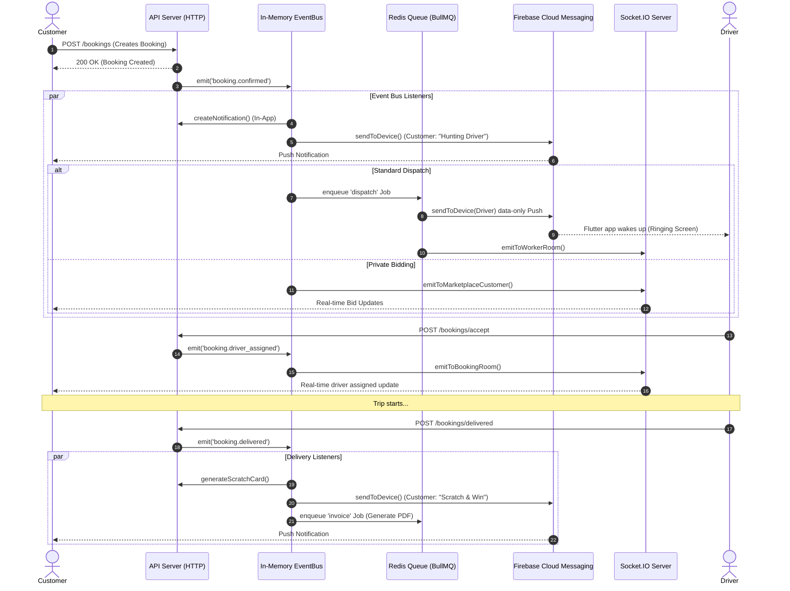

# Real-Time & Asynchronous Event Architecture

This document outlines the event-driven architecture, real-time socket communications, background queues, and cron jobs used in the GoMyTruck backend.

## 1. Socket.IO Communications (`shared/socket`)
Socket.IO is implemented as a singleton to allow background workers (e.g., BullMQ) to emit events seamlessly without needing access to the HTTP server request context.

### Namespaces & Rooms
- **`/tracking` Namespace**
  - **Room:** `booking_{bookingId}` - Used to broadcast live ETA and location updates to the customer and driver during an active trip.
  - **Room:** `driver_{driverId}` - A personal room for drivers (e.g., used by the ULIP worker to push background document verification results).
- **`/workforce` Namespace**
  - **Room:** `worker_{workerId}` - Personal room for workforce members. Used by the dispatch system to push new job alerts directly to specific workers.
- **`/marketplace` Namespace**
  - **Rooms:** `marketplace_customer_{bookingId}`, `marketplace_bid_{bidId}`, `marketplace_user_{userId}` - Used for the private bidding marketplace to emit new bids, counteroffers, and bid acceptance events privately.

## 2. Event-Driven Architecture (`shared/eventbus`)
The core of the asynchronous application logic relies on an in-memory `EventEmitter2` instance known as `TypedEventBus`. 
Events are fired throughout the codebase, and listeners are registered centrally in `shared/eventbus/listeners.ts`.

### Key Global Events Published/Subscribed:
- **`user.registered`**: Sends a welcome FCM push and creates an in-app system notification.
- **`booking.confirmed`**: 
  - Routes the booking to the Dispatch Service or Marketplace (Private Bidding) depending on the `bookingMode`.
  - Also dispatches labor (workers) if applicable.
  - Triggers a customer FCM push notifying them that a driver is being searched for, or that bidding is live.
- **`booking.delivered`**:
  - Triggers the generation of a scratch card reward.
  - Sends an FCM push to the customer to scratch and win coins.
- **`booking.cancelled` & `booking.bid_accepted`**: Triggers targeted FCM pushes and in-app notifications to the relevant drivers.
- **`announcement.created`**: Broadcasts an FCM topic message and queues an announcement job in BullMQ to create in-app notifications for targeted users.

## 3. Background Jobs & Cron Jobs (`shared/jobs`)
Background automated jobs are split into node-cron tasks and long-running setInterval tasks.

- **Cleanup Jobs (`cleanup.job.ts`)**: 
  - Runs every 24 hours.
  - Clears `BookingLocationHistory` older than 30 days to prevent rapid table bloat (estimated at ~3.6M rows/day).
  - Clears expired `RefreshToken` entries.
- **Engagement Jobs (`engagement.job.ts`)**:
  - Powered by `node-cron`.
  - Automatically sends re-engagement push notifications to all users (`all_users` topic) using randomized promotional messages.
  - **Schedule:** 
    - Mon/Wed/Fri at 9:00 AM IST
    - Tue/Thu at 2:00 PM IST
    - Sat at 7:00 PM IST

## 4. Message Queues (`shared/queue`)
Heavy operations, third-party integrations, and scalable dispatches are handled via **BullMQ** backed by Redis.

### Available Queues
- **`otp`**: OTP SMS delivery.
- **`notification`**: Processing bulk or delayed notifications.
- **`invoice`**: Generating PDF invoices for completed trips.
- **`dispatch`**: Managing the algorithmic dispatch of bookings to nearby drivers.
- **`eta-recalc`**: Recalculating live ETA for active trips.
- **`ulip-verification`**: Verifying driver documents via government ULIP APIs in the background.
- **`announcement`**: Bulk generating in-app notifications for large user groups (customers, drivers, fleet owners).

## 5. Push Notifications (FCM)
The `NotificationService` module integrates closely with Firebase Cloud Messaging (FCM).

### Implementation Details:
- **Direct Messaging (`sendToDevice`, `sendToDevices`)**: Capable of sending targeted messages. For dispatch/booking events (`NEW_BOOKING`, `BOOKING_DISPATCH`), payloads are specifically formatted as "data-only" messages. This bypasses the default OS notification tray and allows the Flutter frontend to intercept the payload, wake up, and display custom UI (like a ringing driver dispatch screen).
- **Topic Messaging (`sendToTopic`)**: Used for broad announcements and engagement crons (`topic_customers`, `topic_drivers`, `all_users`).

---

## Complete Event Flow Diagram (Example: Booking Lifecycle)

